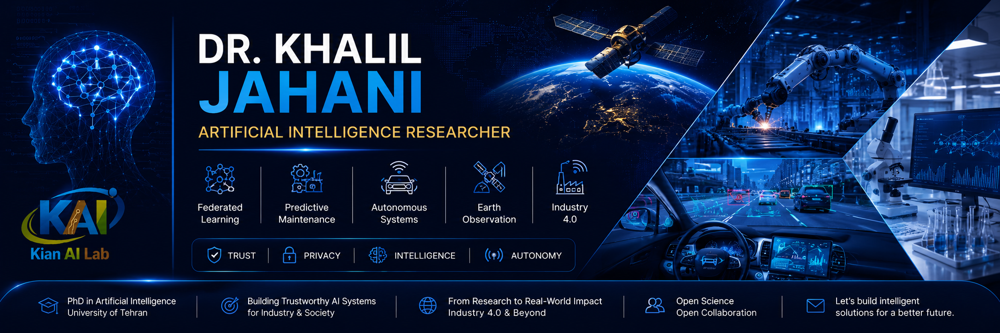

  

# Hi, I'm Dr. Khalil Jahani

### Trustworthy AI Researcher

---

## About Me

I am a Postdoctoral Researcher in Artificial Intelligence at Sharif University of Technology.

My research lies at the intersection of Federated Learning, Reinforcement Learning, Predictive Maintenance, Autonomous Systems, and Space Weather Intelligence.

I am particularly interested in developing trustworthy, scalable, and privacy-preserving AI systems that bridge cutting-edge research and real-world deployment across Industry 4.0, intelligent transportation, and scientific discovery.

---

## Research Vision

Building intelligent systems that bridge cutting-edge AI research and real-world industrial applications.

---

## Research Profile

| Area | Focus |
|--------|--------|
| Federated Learning | Privacy-Preserving Distributed Intelligence |
| Reinforcement Learning | Autonomous Decision-Making Systems |
| Predictive Maintenance | Industry 4.0 and Smart Manufacturing |
| Space Weather AI | Global TEC Forecasting and Ionospheric Modeling |
| Trustworthy AI | Secure, Explainable, and Scalable AI |

---

## Current Research

- Transformer-based TEC Prediction
- Federated Predictive Maintenance
- Reinforcement Learning for Autonomous Systems
- Trustworthy AI Architectures

---

## Featured Projects

### SecurePdM-FL

Secure Federated Learning Architecture for Predictive Maintenance.

### Global TEC Transformer

Transformer-based forecasting of Total Electron Content.

### Autonomous Driving RL

Decision-making systems based on reinforcement learning.

### Federated Learning Toolkit

Open-source FL algorithms and frameworks.

---

## Technical Skills

🧠 AI & ML: Artificial Intelligence • Machine Learning • Deep Learning

🔒 Trustworthy AI: Federated Learning • Privacy-Preserving AI

🤖 Autonomous Systems: Reinforcement Learning • Decision Intelligence

🔄 Foundation Models: Transformers • LLM Agents

⚙️ Engineering: MLOps • Python • PyTorch • TensorFlow

---

## Publications

- PPFL: Privacy-Preserving Techniques in Federated Learning (2024)
- A survey on data distribution challenges and solutions in vertical and horizontal federated learning (2024)
- Secure PDM: A novel Byzantine Fault Tolerant federated learning framework using a robust PCA-based anomaly detection approach (2025)

---
## Academic Profiles

  
  
  
  

---

## Connect

---

## GitHub Statistics

